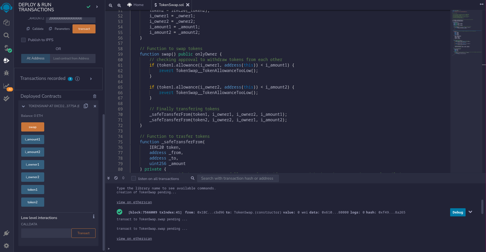

# NFT-ERC20

## Description

It is a simple ERC20 smart contract.
This smart contract swaps two different ERC20 tokens.

## How this is build

I have build this smart contract using the [Foundry](https://github.com/foundry-rs/foundry) and the library openzeppelin contracts.

## Tech Stack Used

I have used following tech stacks:-

- Solidity
- Foundry
- Remix
- OpenZeppelin

## Steps to Run

To run it, we just have to copy the smart contract into [Remix ide](https://remix.ethereum.org/), remix automatically compiles the contract. Then we to just deploy, smart contract's constructor takes 6 arguments:

1. Address of first token to be swapped
2. Address of second token to be swapped
3. Address of owner of first token
4. Address of owner of second token
5. Amount of first token to be swapped
6. Amount of second token to be swapped

After deployment we just have to press swap button and tokens will be swapped.

## Output Screenshots

