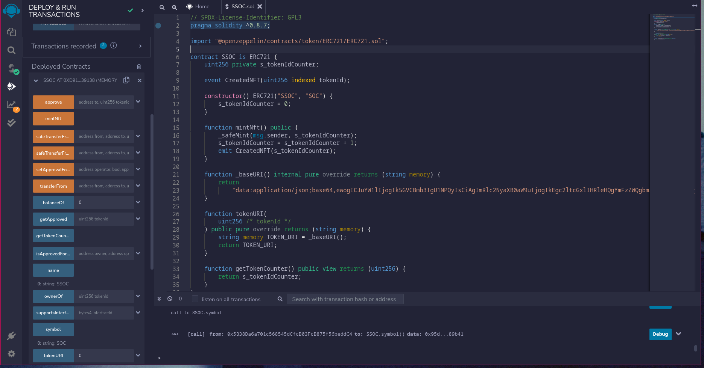
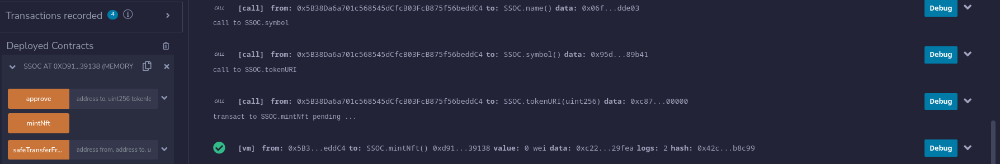
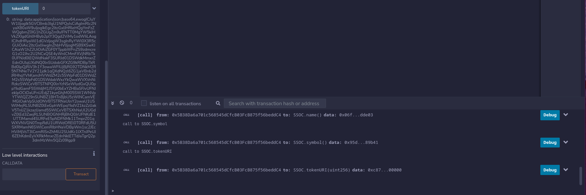

# NFT-ERC721

## Description

It is a simple ERC721 token.
It have a common TokenURI for all minted tokens.
It uses text based svg as token image.
Name of token is SSOC and it's symbol is SOC.

## How this is build

I have build this smart contract using the [Foundry](https://github.com/foundry-rs/foundry) and the library openzeppelin contracts.

## Tech Stack Used

I have used following tech stacks:-

- Solidity
- Foundry
- Remix
- OpenZeppelin

## Steps to Run

To run it, we just have to copy the smart contract into [Remix ide](https://remix.ethereum.org/), remix automatically compiles the contract. Then we to just deploy, smart contract's constructor doesn't take any arguments. After deployment we can mint nft using mintNft function. That's all.

## Output Screenshots

